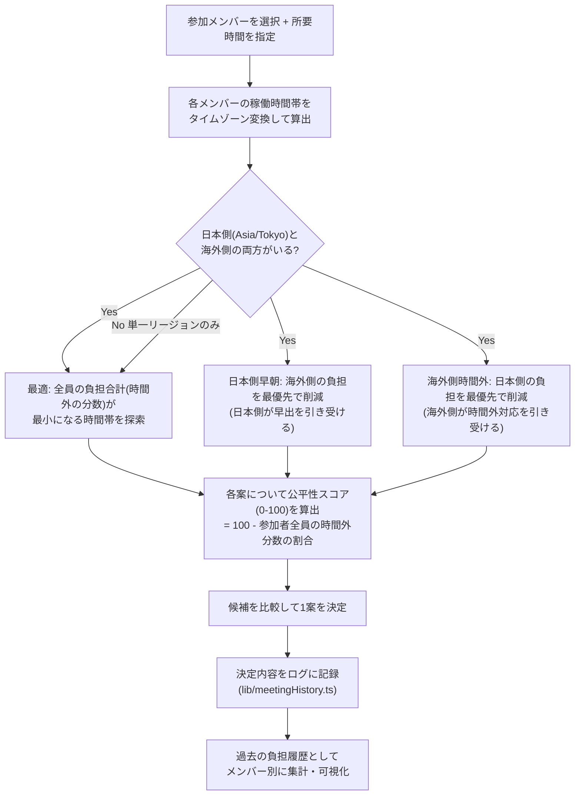

# ブリッジPM (Bridge PM)

海外オフショア開発チームと日本側の橋渡し役（ブリッジSE／PM）向けの、多言語・タイムゾーン対応プロジェクト管理アプリの MVP です。詳細な企画意図は [CLAUDE.md](./CLAUDE.md) を参照してください。

## 対象ユーザー・解決したい課題

- **対象ユーザー**: 日本企業と海外の開発チーム(拠点・タイムゾーン・言語がバラバラ)を橋渡しするブリッジSE／PM。
- **解決したい課題**:
  - 誰が今稼働中で、誰が過負荷になっているかが分からない。
  - 会議時間を決めるたびに、毎回同じ拠点(多くは海外側)が早朝・深夜対応を強いられ、それが可視化されないまま続く。
  - タスクの遅延やブロックが、進捗率の羅列に埋もれて気づきにくい。
  - タスク説明の翻訳が「訳したつもり」で終わり、誤訳や用語の表記ゆれがそのまま仕様伝達の事故につながる。
- 想定される使い方は、毎朝ダッシュボードで状況を確認 → 必要な画面(プロジェクト/メンバー/カレンダー/会議)に入って対応する、という一日の起点として使うイメージです。

## 実装済み機能（MVP）

- **今日のダッシュボード(トップ画面)**: プロジェクト一覧ではなく、ブリッジPMが毎朝まず確認すべき状況を1画面に集約。稼働中/まもなく終業のメンバー、ブロック中タスクとその依存先、過負荷メンバー、予算超過リスクのある案件、次回定例会議と全メンバーでの推奨会議枠を表示し、そこから優先度の高い項目を最大3件「今日確認すべきこと」として強調。各カードから該当画面へワンクリックで遷移できる。
- **プロジェクト管理**: プロジェクト(名前・ジャンル・ステータス・現在フェーズ・開始日/リリース目標日)を登録し、メンバーのアサイン(役割・週間配分時間)を紐付け。プロジェクトに紐づくタスクの件数・完了数も表示。
- **要員の稼働配分・過負荷判定**: メンバーごとの週間稼働上限(`weeklyCapacityHours`)と、全プロジェクトへのアサイン時間の合計をつき合わせ、上限を超えたメンバーには「過負荷」バッジを表示。値はプロジェクト側のアサインから毎回再計算するため、上限や配分を変更しても手動で同期する必要はない。
- **予算超過リスクの可視化・スケジュール延長コストシミュレーション**: プロジェクトごとに「週次バーンレート」(アサインされた各メンバーの時間単価USD×配分時間の合計)を算出し、①現時点までの消化額 ②現在の人員配置のまま完走した場合の総コスト予測 を表示。予測が予算総額を超える場合は「予算超過リスクあり」バッジを表示。延長日数を入力すると、追加コストをその場でシミュレーションできる。すべて「現在の人員配置が変わらない」という単純化前提の目安値である旨をUI上に明記。
- **タスクはメンバー起点で管理**: 各メンバーのカードに「担当タスク」として表示・追加・編集。タイトル(日英)・説明(日英)・所属プロジェクト・開始日・期限・ステータス・依存タスク・翻訳ステータスを管理でき、依存タスクが未完了のまま残っている場合は警告表示。
- **カレンダー(「進捗の羅列」ではなく「リスクの地図」)**: プロジェクト・メンバーで絞り込んだ上で、稼働中のタスクをプロジェクト色のコンパクトなバーで表示。**ブロック中・期限超過・依存タスク未解決**のいずれかに該当するタスクだけを⚠付きの赤枠で強調し、リスクが埋もれないようにする。バー横の%は経過日数から算出した「予定ペース」の目安であり、実績の進捗とは明確に分離して表示(実績データそのものは保持していない)。メンバーが同時期に複数プロジェクトのタスクを抱えている「稼働の衝突」も検出して一覧表示。
- **メンバー管理**: 氏名・役割・拠点・タイムゾーン・稼働時間帯・稼働曜日・使用言語を登録し、各メンバーの現在時刻をリアルタイム表示。稼働曜日を持たせているのは、拠点によって週末が異なるケース(例: ドバイは金・土が休みで日曜が稼働日)に対応するため。
- **会議候補の複数案提示・公平性の可視化（差別化のコア機能）**: 参加メンバーと所要時間(30/45/60分)を選ぶと、「最適」「日本側早朝」「海外側時間外」の最大3案を提示(詳細は下記「会議提案ロジックの説明」)。各案の公平性スコア・参加者ごとの現地時間・時間外バッジ・今回の負担者を表示し、決定した案はログに記録して「過去の負担履歴」をメンバー別に可視化(特定拠点への偏りに気づける)。決定した候補はカレンダー登録用テキストとしてコピー可能。
- **定例会議(週表示カレンダー)**: 毎週同じ曜日・時刻に行う会議を登録でき、時間軸つきの週間カレンダーに表示。表示タイムゾーンを切り替えると各会議が実際に何曜日の何時になるかを正しく再計算する。
- **AI翻訳を「人が確認できるワークフロー」として提供**: タスクの原文(日本語)と訳文(英語)は常に両方保持して並べて管理し、翻訳ステータス(未翻訳/下書き/レビュー済み)を持たせる。さらに用語集の訳語が訳文に反映されているかを自動チェックし、未反映なら警告。機械翻訳が誤訳しやすい曖昧な表現(「など」「よしなに」「適宜」等のキーワード)を検出して要確認フラグを立てる。対応言語は現状**日本語・英語のみ**で、ベトナム語は次の追加候補(下記「今後の拡張予定」参照)。
- **技術用語集**: 日英対訳＋メモを登録・検索。
- **多言語UI切り替え**: ヘッダーのボタンで日本語⇔英語をワンクリック切り替え。
- **デモ体験の補助**: ヘッダーに「デモモード」バッジを常設し、localStorageのみで動作するデモであることを明示。3ステップの使い方ガイド(「使い方ガイド」ボタン)、全データのJSONエクスポート/インポート(バックアップ・移行用)を用意。

サンプルデータはゲーム開発スタジオを想定した架空のシナリオ([docs/bridge_pm_dummy_data.json](./docs/bridge_pm_dummy_data.json)、6拠点13名・過負荷2名・依存関係とブロック中タスクを含む)を元にしている。過負荷判定やドバイの稼働曜日は、このデータに付属する期待値と突き合わせて動作確認済み。

### サンプルデータの自動更新について（デモ専用の挙動）

開発中に頻繁にサンプルデータを更新するため、`src/lib/seedVersion.ts` のバージョン文字列をキーに、ブラウザに保存済みのデータと最新のサンプルデータが食い違っていれば**自動的に最新のサンプルデータへリセットする**仕組みを入れている。ヘッダーのメニューから「サンプルデータにリセット」でも手動でいつでもリセットできる。**これはあくまでデモ用の挙動であり、実データを入力し始めたら `CURRENT_SEED_VERSION` を固定するかリセット処理自体を無効化すること**(でないと入力したデータが不意に消える)。心配な場合は、まずヘッダーメニューの「データをエクスポート」でバックアップを取ってから運用を始めるとよい。

## 会議提案ロジックの説明

参加メンバーを選ぶと、以下の流れで最大3つの候補を計算する(`src/lib/meetingCandidates.ts`)。



- 「負担」は、その時間帯のうちメンバーの稼働時間外にかかる分数の合計。
- 公平性スコアは `100 - (全参加者の負担分数の合計) / (参加者数 × 所要時間) × 100` で算出する単純な指標で、0が「全員が丸ごと時間外」、100が「誰も負担なし」。
- 「過去の負担履歴」は、定例会議(固定の負担発生源)と、過去にこの画面で「決定」した会議のログを合算して、メンバーごとに時間外対応の回数を集計したもの。特定拠点・メンバーへの偏りに気づくための目安であり、厳密な労務管理の数値ではない。

## 制約事項・注意点

- **データ保存はブラウザの localStorage のみ**: サーバーはなく、複数端末・複数人での共有はできない。共有が必要になった場合はエクスポートしたJSONを手動で受け渡すか、下記「今後の拡張予定」のバックエンド導入を検討する。
- **予算・コストの計算は簡略化されたモデル**: 「現在の人員配置(週次バーンレート)がプロジェクト期間中ずっと変わらない」という前提の目安値。実際のフェーズごとの人員増減は反映されない。
- **カレンダーの%は「予定ペース」であり実績ではない**: 開始日〜期限の経過日数から機械的に算出した目安で、実績の入力機能自体が存在しない。
- **会議の公平性スコア・負担履歴は簡易指標**: 労務時間の厳密な管理を目的としたものではなく、「偏りに気づくきっかけ」を与えるための単純化した数値。
- **翻訳の「曖昧表現検出」はキーワード一致による簡易チェック**: 実際の言語モデルによる解析ではなく、決め打ちのキーワードリスト(`src/lib/translationWorkflow.ts`)との一致を見ているだけの簡易ヒューリスティック。
- **対応言語は日本語・英語のみ**: ベトナム語UIは未実装(下記参照)。
- **メンバーの「稼働中」判定は稼働時間帯・稼働曜日の設定に基づく単純な時刻比較**: 祝日・休暇等は考慮しない。
- サンプルデータの日付は2026-09-12を閲覧基準日として固定で調整してあり(「アラビア語ローカライズ」タスクのみ、リスク表示の動作確認用に意図的に期限超過のまま残している)、基準日から離れるほど「予定ペース」表示の意味合いは薄れていく。運用が長期化する場合は、`docs/bridge_pm_dummy_data.json` の期限日を作り直すか、実データに置き換えることを推奨する。

## 今後の拡張予定

- **ベトナム語UIの追加**: `UILang` 型とi18n辞書の拡張、および用語集・翻訳ワークフローのベトナム語対応。
- **サーバー保存・複数人での共有**: Supabase等の無料枠を使った認証・データ同期(現状はlocalStorageのみ)。
- **AIによる翻訳下書きの自動生成**: Claude API等を使い、`translationStatus: 'draft'` の初期案を自動生成する(現状は人が翻訳文を入力し、ステータスを進める運用)。`Task` 型は元々 `titleJa`/`titleEn` を分けて持つ構造なので、片方を自動生成するロジックを後から差し込みやすい。
- **会議候補ロジックの拡張**: 3リージョン以上の拠点分布への対応、過去の負担履歴を候補のスコアリング自体に反映(「直近で負担の少ない拠点を優先する」等)。
- **カレンダーの期間バー表示の強化**: 週をまたぐタスクを1本の連続したバーとして描画する等、視覚的な連続性の向上。
- **実績進捗の入力**: 「予定ペース」とは別に、実際の進捗率を人が入力できるようにし、両者を並べて比較できるようにする。

## 技術スタック（すべて無料・オープンソースライセンス）

| 用途 | 採用技術 | ライセンス |
| --- | --- | --- |
| フロントエンド | React 19 + TypeScript | MIT |
| ビルドツール | Vite | MIT |
| スタイリング | Tailwind CSS v4 | MIT |
| タイムゾーン計算 | date-fns / date-fns-tz | MIT |
| データ保存 | ブラウザ localStorage | — (追加ライブラリなし) |
| Lint | oxlint | MIT |

外部APIキーやアカウント登録は一切不要です。`npm install` のみで開発を開始できます。

## セットアップ

```bash
npm install
npm run dev
```

`http://localhost:5173` で確認できます。初回起動時はデモ用のサンプルデータ（架空のメンバー・タスク・用語）が表示されます。編集・削除して実際のデータに置き換えてください。

## ビルド

```bash
npm run build
```

## データの扱いについて

すべてのデータはブラウザの localStorage にのみ保存され、外部サーバーへの送信は行われません。ブラウザのデータを削除するとプロジェクト・タスク・メンバー・用語集・会議の負担履歴が失われる点に注意してください。ヘッダーのメニューから全データをJSON形式でエクスポート/インポートできるため、バックアップや別ブラウザへの移行が必要な場合はこちらを利用してください。
